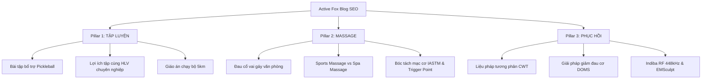

# ĐỀ XUẤT PHƯƠNG ÁN CHIẾN LƯỢC NỘI DUNG SEO BLOG
**DỰ ÁN: HỆ THỐNG HUẤN LUYỆN & PHỤC HỒI THỂ CHẤT ACTIVE FOX (LAUNCHING 08/2025)**

---

## I. TỔNG QUAN CHIẾN LƯỢC & ĐỊNH VỊ THƯƠNG HIỆU

Active Fox được định vị là **"Hệ thống huấn luyện & phục hồi thể chất theo tiêu chuẩn quốc tế"**. Nhằm chuẩn bị cho chiến dịch ra mắt chính thức vào tháng 8/2025 tại 2 cơ sở (Sala Q2 & Cao Thắng Q10), chiến lược SEO Blog cần tập trung xây dựng sự uy tín về mặt chuyên môn thể thao y học, giáo dục thị trường về phục hồi công nghệ cao, đồng thời tối ưu hóa tỷ lệ chuyển đổi khách hàng tiềm năng thành hội viên đăng ký trải nghiệm dịch vụ.

### 1. Mục tiêu chiến lược SEO
*   **Độ phủ thương hiệu (Brand Awareness)**: Tiếp cận tệp người dùng chơi thể thao phong trào (chạy bộ, gym, pickleball, leo núi...) và nhóm nhân viên văn phòng có thu nhập cao đang gặp vấn đề về xương khớp.
*   **Tăng trưởng Organic Traffic chất lượng**: Tập trung vào các từ khóa có tỷ lệ chuyển đổi cao (High-Intent Keywords), không chạy theo lượng truy cập đại trà.
*   **Thiết lập E-E-A-T (Chuyên môn & Độ tin cậy)**: Khẳng định uy tín học thuật và thực tiễn của đội ngũ HLV/Trị liệu viên của Active Fox bằng nội dung chuẩn Credential.
*   **Tối ưu hóa phễu chuyển đổi (Conversion Rate Optimization - CRO)**: Dẫn dắt người đọc tự nhiên từ việc tìm hiểu triệu chứng đến đăng ký đặt lịch trải nghiệm thực tế.

---

## II. CHI TIẾT 3 TRỤ CỘT NỘI DUNG SEO BÀI BẢN (CONTENT PILLARS)

Đề xuất chia kế hoạch nội dung thành 3 cụm chủ đề lớn (Topic Clusters) tương ứng với 3 mũi nhọn dịch vụ chính của Active Fox:

---

### PILLAR 1: TẬP LUYỆN (Huấn luyện, Tập cùng HLV, Lớp tập nhóm)
> [!NOTE]
> **Nhóm đối tượng tiếp cận**: Người muốn bắt đầu tập luyện bài bản, người chơi thể thao phong trào muốn nâng cao hiệu suất và tránh chấn thương.

| STT | Tiêu đề bài viết đề xuất | Từ khóa mục tiêu | Mục đích tìm kiếm (Intent) | Điểm chạm chuyển đổi (CTA) tại Active Fox |
| :--- | :--- | :--- | :--- | :--- |
| 1 | **Chấn thương thường gặp khi chơi Pickleball và cách phòng tránh bằng bài tập bổ trợ** | *chấn thương pickleball, bài tập bổ trợ pickleball, tập pickleball đúng cách* | Tìm kiếm giải pháp khi bị đau mỏi hoặc sợ chấn thương khi chơi môn thể thao đang hot. | Giới thiệu lớp **Độ Khớp** độc quyền – nâng cao biên độ vận động khớp, phòng chấn thương tại Sala & Cao Thắng. |
| 2 | **Tại sao tự tập gym mãi không hiệu quả? 5 lợi ích vượt trội khi tập cùng HLV chuyên nghiệp** | *tập cùng HLV, thuê PT gym, huấn luyện viên cá nhân quận 2, HLV gym chuyên nghiệp* | Người tự tập lâu năm bị chững cân, chững tạ hoặc hay gặp chấn thương nhẹ. | Tặng 01 buổi tư vấn thể chất và tập thử miễn phí cùng đội ngũ HLV 1:1 chuẩn y sinh của Active Fox. |
| 3 | **Giáo án chạy bộ cho người mới bắt đầu: Làm sao để chạy liên tục 5km không mệt?** | *giáo án chạy bộ cho người mới, cách chạy bộ không mệt, kỹ thuật chạy bộ đúng cách* | Người mới chạy bộ muốn xây dựng sức bền tim mạch khoa học. | Giới thiệu lớp **Fox Run** chuẩn kỹ thuật chạy bộ nền tảng - biến tốc để tối ưu sức bền. |

---

### PILLAR 2: MASSAGE (Massage Trị Liệu, Massage Thể Thao, Cổ Vai Gáy)
> [!IMPORTANT]
> **Nhóm đối tượng tiếp cận**: Dân văn phòng bị đau mỏi cột sống mãn tính; vận động viên phong trào cần giải cơ sâu sau các buổi tập nặng.

| STT | Tiêu đề bài viết đề xuất | Từ khóa mục tiêu | Mục đích tìm kiếm (Intent) | Điểm chạm chuyển đổi (CTA) tại Active Fox |
| :--- | :--- | :--- | :--- | :--- |
| 1 | **Đau cổ vai gáy kéo dài ở dân văn phòng: Khi nào massage thư giãn thông thường là chưa đủ?** | *đau cổ vai gáy dân văn phòng, massage trị liệu cổ vai gáy, giải pháp đau cổ vai gáy* | Dân văn phòng đau nhức mãn tính, đã đi nhiều spa thường nhưng chỉ đỡ tạm thời vài ngày. | Giới thiệu liệu pháp **Massage Trị Liệu Y Khoa** giải phóng các nút thắt cơ học (Trigger Point) và bóc tách màng cơ sâu. |
| 2 | **Sports Massage vs. Spa Massage: Điểm khác biệt cốt lõi người chơi thể thao phải biết** | *massage thể thao, sports massage là gì, massage trị liệu thể thao tphcm* | Người tập thể thao cường độ cao đang tìm kiếm liệu pháp phục hồi cơ bắp đúng nghĩa. | Đặt lịch dịch vụ **Sports Massage** chuyên nghiệp, sử dụng kết hợp súng massage lực sâu, giác hơi mạc cơ y học. |
| 3 | **Giải pháp bóc tách mạc cơ (Myofascial Release) bằng dao chải IASTM: Liệu pháp "vàng" khôi phục vận động** | *giải phóng mạc cơ là gì, dao chải mạc cơ iastm, trị liệu mạc cơ* | Tìm hiểu sâu về các liệu pháp trị liệu cơ xương khớp hiện đại, chuẩn y khoa thể thao. | Giới thiệu công cụ thép không gỉ chuyên dụng **IASTM** và trị liệu bằng tay từ chuyên gia Active Fox. |

---

### PILLAR 3: PHỤC HỒI (Giảm đau cơ, Phục hồi thể chất công nghệ cao)
> [!TIP]
> **Nhóm đối tượng tiếp cận**: Khách hàng phân khúc cao cấp tìm kiếm giải pháp hồi phục thể trạng nhanh nhất, tiếp cận xu hướng công nghệ phục hồi tiên tiến nhất thế giới.

| STT | Tiêu đề bài viết đề xuất | Từ khóa mục tiêu | Mục đích tìm kiếm (Intent) | Điểm chạm chuyển đổi (CTA) tại Active Fox |
| :--- | :--- | :--- | :--- | :--- |
| 1 | **Ngâm nóng lạnh luân phiên (Contrast Water Therapy): Khoa học đằng sau liệu pháp hồi phục thần tốc** | *ngâm nóng lạnh luân phiên, contrast water therapy là gì, ngâm đá lạnh giảm đau cơ* | Tìm hiểu cơ chế sinh lý của liệu pháp ngâm bồn nóng - lạnh phổ biến ở các VĐV quốc tế. | Mời trải nghiệm hệ thống bồn ngâm nóng - lạnh chuyên nghiệp tại cơ sở **Active Fox Cao Thắng** sau khi tập luyện. |
| 2 | **Đau mỏi cơ sau tập (DOMS): 4 cách giảm đau cơ chuẩn khoa học giúp cơ thể phục hồi nhanh gấp đôi** | *giảm đau cơ sau tập, hiện tượng doms, cách phục hồi cơ bắp nhanh nhất* | Người mới tập nặng bị đau nhức cơ bắp kéo dài cản trở sinh hoạt. | Giới thiệu combo phục hồi: Quần massage nén khí **Normatec**, súng trị liệu percussive và kéo giãn hỗ trợ. |
| 3 | **Indiba RF 448kHz và EMSculpt: Bí quyết duy trì đỉnh cao của Messi và Cristiano Ronaldo** | *công nghệ indiba là gì, sóng rf 448khz, phục hồi cơ bằng công nghệ cao, emsculpt trị liệu* | Tò mò về công nghệ phục hồi hiện đại được các siêu sao thế giới tin dùng; tìm địa điểm có máy tại TP.HCM. | Định vị thương hiệu dẫn đầu công nghệ phục hồi với bộ đôi máy **FoxFlex 448 (Indiba RF)** và **Magair Elite Sculpt+ (HIFEM)** tại Active Fox. |

---

## III. CHIẾN THUẬT TỐI ƯU SEO & KỸ THUẬT (ON-PAGE SEO & E-E-A-T)

Để các bài viết trên nhanh chóng leo top Google và tạo dựng lòng tin tối đa với khách hàng, chúng tôi sẽ áp dụng nghiêm ngặt các tiêu chuẩn sau:

1.  **Từ khóa Địa phương (Local SEO)**: Lồng ghép khéo léo các từ khóa địa điểm vào tiêu đề phụ và nội dung bài viết như *"trị liệu cổ vai gáy quận 2"*, *"sports massage quận 10"*, *"chạy bộ Sala Q2"* nhằm hút chính xác khách hàng có khả năng đến phòng tập thực tế.
2.  **Thông tin minh bạch chuyên môn (E-E-A-T Box)**: Cuối mỗi bài viết sẽ tích hợp một khung thông tin:
    > *Bài viết được tham vấn chuyên môn bởi Ban cố vấn Y học Thể thao & Trị liệu viên trưởng tại Hệ thống phục hồi Active Fox.*
3.  **Tối ưu Internal Link (Liên kết nội bộ)**: 
    *   Các bài viết thuộc Pillar 1 sẽ trỏ liên kết về trang dịch vụ `/huan-luyen-vien` hoặc `/lich-tap`.
    *   Các bài viết thuộc Pillar 2 và 3 sẽ trỏ liên kết trực tiếp về các trang `/tri-lieu` và `/dich-vu/massage-tri-lieu` để gia tăng sức mạnh SEO (Link Equity) cho các trang bán hàng chính.
4.  **Bố cục chuẩn Mobile & UX**: Đoạn văn ngắn gọn, chèn hình ảnh thực tế chất lượng cao tại cơ sở Active Fox, chèn nút kêu gọi hành động (CTA Button) rõ ràng ở giữa và cuối bài viết.

---

## IV. TIẾN ĐỘ TRIỂN KHAI & ĐÁNH GIÁ HIỆU QUẢ (KPIs)

*   **Giai đoạn 1 (Tháng 5 - Tháng 6/2025)**: Thiết lập cấu trúc trang Blog trên website, hoàn thiện lập trình giao diện chuẩn SEO, đăng tải 5 bài viết cốt lõi đầu tiên để Google index.
*   **Giai đoạn 2 (Tháng 7/2025)**: Đăng tải đều đặn 2 bài viết/tuần theo kế hoạch, tối ưu hóa các liên kết nội bộ hướng tới trang dịch vụ, chia sẻ lên Fanpage để kéo traffic ban đầu.
*   **Giai đoạn 3 (Tháng 8/2025 - Launching)**: Tăng tốc các bài viết theo xu hướng, tối ưu hóa form đăng ký tập thử trên Blog để đo lường lượng chuyển đổi (Leads).

### Chỉ số đo lường hiệu quả (KPIs) đề xuất trình sếp duyệt:
*   **Tổng số lượng bài viết chuẩn SEO**: Đạt tối thiểu 15 bài viết chuyên sâu trong 2 tháng đầu.
*   **Thời gian trên trang (Time on Page)**: Trung bình đạt > 2.5 phút/người dùng (thể hiện nội dung hữu ích, chất lượng cao).
*   **Chuyển đổi (Conversion rate)**: 1.5% - 3% lượng người đọc blog nhấp vào nút CTA và điền thông tin đăng ký tư vấn tập thử / trị liệu tại Active Fox.

---
*Kính trình sếp xem xét và phê duyệt phương án triển khai nội dung SEO Blog cho chiến dịch ra mắt Hệ thống Phục hồi & Huấn luyện Active Fox.*
